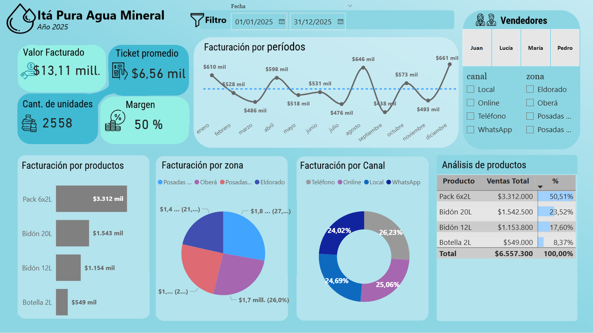

# Análisis-Ventas-Agua-Mineral

# 📊 Dashboard de Ventas – Itá Pura Agua Mineral

## 📎 Vista del dashboard

# 🧠 Data Storytelling – Ita Pura Agua Mineral (2025)

Análisis narrativo basado en el dashboard de ventas, facturación y comportamiento comercial.

---

## 📊 La empresa **Ita Pura Agua Mineral** registra en 2025:

- 💰 **Facturación total:** $13,11 millones  
- 🧾 **Ticket promedio:** $6,56 mil  
- 📦 **Unidades vendidas:** 2.558  
- 📈 **Margen:** 50%

### Evolución mensual
La facturación muestra variaciones importantes:

- 📈 Picos: agosto ($646 mil) y diciembre ($661 mil)
- 📉 Caídas: septiembre ($438 mil)

Esto indica una **demanda irregular a lo largo del año**.

### Productos
- 🥇 Pack 6x2L: **50,5% de las ventas**
- 🥈 Bidón 20L: 23,5%
- 🥉 Bidón 12L: 17,6%
- ⚪ Botella 2L: 8,3%

---

## 🔍Posible **estacionalidad del consumo de agua**
- El Pack 6x2L podría ser el más accesible o más promocionado
- Distribución de canales bastante equilibrada:
  - Local
  - Online
  - WhatsApp
  - Teléfono

No hay un canal dominante, lo que indica **estrategia multicanal estable pero no optimizada**.

---

## ⚠️ Alta **dependencia del Pack 6x2L** (>50% del negocio)
- Riesgo ante caída de un solo producto
- Variabilidad mensual afecta la **previsibilidad del negocio**
- Posible dificultad para planificación de stock e ingresos

---

## 💡 Negocio con **buen volumen y rentabilidad**
- Pero con **concentración de ingresos en pocos productos**
- Canales equilibrados, sin liderazgo claro
- Posible presencia de **patrones estacionales**

---

## 🚀 ¿Qué se debería hacer?

- Diversificar el portafolio de productos
- Analizar qué impulsó los meses pico (agosto y diciembre)
- Replicar estrategias exitosas en meses bajos
- Optimizar canales con mayor potencial de crecimiento
- Explorar estrategias por zona y segmento de cliente

---

## 📌 Conclusión

El negocio presenta un desempeño sólido, pero con oportunidades claras de mejora en:

- Diversificación de productos  
- Estabilización de ingresos mensuales  
- Optimización comercial por canal y zona  

El principal desafío es **reducir la dependencia del producto estrella sin perder volumen de ventas**.

---

## 🛠️ Herramientas utilizadas

* **Power BI** – Visualización y construcción del dashboard
* **Excel / SQL** – Procesamiento y limpieza de datos
* **Python** – Análisis exploratorio
  
---

## 👩‍💻 Autor

Gladys – Data Analyst
Proyecto de portfolio
